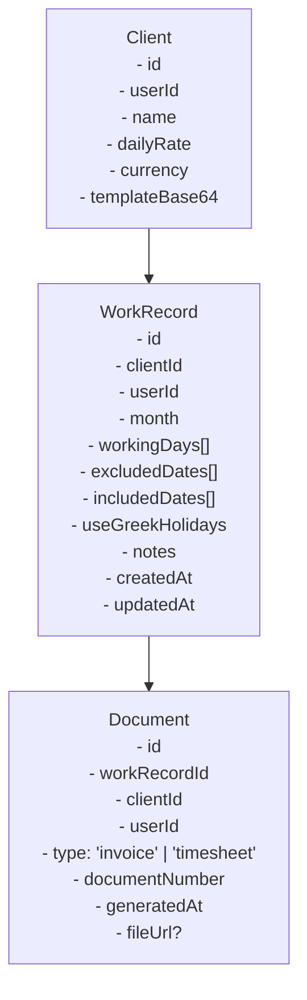
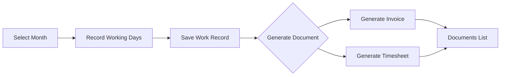

# Work Record Feature - Refactoring Plan

## 1. Current State Analysis

### Current Data Model Issues

The current implementation has **tight coupling** between working days and invoices:

```
InvoiceRecord (current)
├── id: string
├── userId: string
├── clientId: string
├── month: string (YYYY-MM)
├── excludedDates: string[]     ← Working days logic
├── includedDates: string[]     ← Working days logic
├── useGreekHolidays: boolean   ← Working days logic
├── manualAdjustment: number
├── status: 'draft' | 'generated'
├── invoiceNumber?: string
├── generatedDate?: string
└── totalAmount?: number
```

**Problems:**
1. Working days are tied to invoice generation - you can't save work records independently
2. No way to create multiple documents (invoice, timesheet) from the same work record
3. Historical invoice data is immutable but work day data may need corrections
4. Can't generate a timesheet without creating an invoice first
5. Invoice recreation requires re-entering all working day exclusions

---

## 2. Proposed Data Architecture

### New Entity Relationship Diagram



### New TypeScript Interfaces

```typescript
// Core entity: Represents the days you worked
interface WorkRecord {
  id: string;
  userId: string;
  clientId: string;
  month: string; // YYYY-MM format
  
  // STORED FACT: Explicit list of working days (ISO date strings)
  // This is the canonical source of truth for days worked
  workingDays: string[];
  
  // Display metadata: Holiday names for UI display purposes
  // Map of date -> holiday name (e.g., {"2024-03-25": "Independence Day"})
  holidayNames?: Record<string, string>;
  
  // CONFIGURATION (for editing/reproducibility): How workingDays was calculated
  // These are INPUT parameters, not the stored fact
  config: {
    useGreekHolidays: boolean;      // Whether Greek holidays were excluded
    excludedDates: string[];        // Dates manually excluded (leave days)
    includedDates: string[];        // Dates manually included (overtime weekends/holidays)
    autoExcludedWeekends: boolean;  // Whether weekends were auto-excluded
  };
  
  // Metadata
  notes?: string;
  createdAt: string;
  updatedAt: string;
  
  // Calculated fields (stored for performance)
  totalWorkingDays: number;
  totalAmount: number;
}

// Generated document (invoice, timesheet, etc.)
interface Document {
  id: string;
  userId: string;
  clientId: string;
  workRecordId: string; // Link to the work record
  
  type: 'invoice' | 'timesheet';
  documentNumber: string; // Invoice # or Timesheet #
  
  // Snapshot of work data at generation time
  month: string;
  workingDays: number;
  dailyRate: number;
  totalAmount: number;
  
  // Document metadata
  generatedAt: string;
  fileName?: string;
  
  // For invoices specifically
  isPaid?: boolean;
  paidAt?: string;
}
```

---

## 3. Firestore Schema Changes

### Collections

```
/clients/{clientId}          - Unchanged
/workRecords/{workRecordId}  - NEW
/documents/{documentId}      - NEW (replaces invoices collection)
```

### Firestore Rules Update

```javascript
rules_version = '2';
service cloud.firestore {
  match /databases/{database}/documents {
    // Clients collection (existing)
    match /clients/{clientId} {
      allow read, write: if request.auth != null && 
        request.auth.token.email == 's.gioldasis@gmail.com';
    }
    
    // NEW: Work Records collection
    match /workRecords/{workRecordId} {
      allow read: if request.auth != null && 
        request.auth.token.email == 's.gioldasis@gmail.com';
      allow write: if request.auth != null && 
        request.auth.token.email == 's.gioldasis@gmail.com' &&
        request.resource.data.userId == request.auth.uid;
    }
    
    // NEW: Documents collection (replaces invoices)
    match /documents/{documentId} {
      allow read: if request.auth != null && 
        request.auth.token.email == 's.gioldasis@gmail.com';
      allow write: if request.auth != null && 
        request.auth.token.email == 's.gioldasis@gmail.com' &&
        request.resource.data.userId == request.auth.uid;
    }
  }
}
```

---

## 4. New UI Flow & Navigation

### Proposed Navigation Structure

```
┌─────────────────────────────────────────────────────────────┐
│  SmartInvoice                                               │
├─────────────────────────────────────────────────────────────┤
│                                                             │
│  📋 Work Records  ← NEW PRIMARY SECTION                     │
│     └── Monthly calendar for recording working days         │
│                                                             │
│  👥 Clients                                                 │
│     └── Manage client profiles and templates                │
│                                                             │
│  📄 Documents  ← NEW                                        │
│     ├── Invoices                                            │
│     └── Timesheets                                          │
│                                                             │
│  📊 Analytics                                               │
│                                                             │
└─────────────────────────────────────────────────────────────┘
```

### User Flow



---

## 5. Component Refactoring Plan

### New Components

| Component | Purpose | Location |
|-----------|---------|----------|
| `WorkRecordManager` | Main calendar interface for recording working days | `components/WorkRecordManager.tsx` |
| `WorkRecordList` | List view of all work records by month/client | `components/WorkRecordList.tsx` |
| `DocumentGenerator` | Generate invoices/timesheets from work records | `components/DocumentGenerator.tsx` |
| `DocumentList` | View all generated documents with filters | `components/DocumentList.tsx` |
| `TimesheetTemplate` | Generate timesheet Excel files | `services/timesheetService.ts` |

### Refactored Components

| Component | Changes |
|-----------|---------|
| `InvoiceGenerator` | Rename to `DocumentGenerator`, accept workRecordId prop |
| `Dashboard` | Add Work Records quick access |
| `DB` service | Add work record and document CRUD operations |

### Services Refactoring

```typescript
// New DB service structure
const DB = {
  // Existing
  getClients, saveClient, deleteClient,
  
  // NEW: Work Records
  getWorkRecords,
  getWorkRecordByMonth, // Check if record exists for month/client
  saveWorkRecord,
  deleteWorkRecord,
  
  // NEW: Documents (replaces invoices)
  getDocuments,
  getDocumentsByWorkRecord,
  saveDocument,
  deleteDocument,
  
  // MIGRATION: Keep temporarily
  getInvoices, // Mark as deprecated
  migrateInvoiceToWorkRecord, // One-time migration
};
```

---

## 6. Implementation Roadmap

### Phase 1: Foundation (No breaking changes)
1. Add new Firestore collections (`workRecords`, `documents`)
2. Update Firestore rules
3. Create TypeScript interfaces
4. Add new DB service methods

### Phase 2: Work Record UI
1. Create `WorkRecordManager` component (calendar view)
2. Add "Work Records" navigation tab
3. Implement save/load for work records
4. Test work record persistence

### Phase 3: Document Generation
1. Create `DocumentGenerator` component
2. Add support for generating from work record
3. Implement timesheet template generation
4. Create `DocumentList` for viewing all documents

### Phase 4: Migration & Cleanup
1. Migrate existing invoice data to new schema
2. Update Analytics to use new data model
3. Deprecate old invoice-only flow
4. Remove `InvoiceRecord` interface

### Phase 5: Enhanced Features
1. Add notes field to work records
2. Support multiple document types
3. Add document templates for timesheets
4. Bulk operations on work records

---

## 7. Data Relationships & Business Rules

### Core Rules

1. **One Work Record per Client per Month**
   - Each client can have only one work record per month
   - Work records can be edited until documents are generated
   - Editing a work record after document generation creates a new revision

2. **Documents are Immutable Snapshots**
   - Once generated, documents capture the state of the work record
   - Regenerating a document creates a new document entry
   - Old documents are kept for historical reference

3. **Document Types**
   - Invoice: Client-specific, uses client's Excel template
   - Timesheet: Company-specific format, detailed day-by-day breakdown

### State Transitions

```
Work Record States:
  DRAFT → SAVED → (has documents) → LOCKED
   ↑                              ↓
   └──────────────────────────────┘ (manual unlock for editing)

Document States:
  GENERATED → (optionally) MARKED_AS_PAID (invoices only)
```

---

## 8. Migration Strategy

### Existing Invoice Data

Current `InvoiceRecord` objects will be migrated:

```typescript
// Migration mapping
InvoiceRecord → WorkRecord + Document

InvoiceRecord {
  clientId, month, excludedDates, includedDates,
  useGreekHolidays, invoiceNumber, generatedDate, totalAmount
}

// Creates:
WorkRecord {
  clientId, month,
  // STORED FACT: Derive workingDays from old invoice configuration
  workingDays: calculateWorkingDays(month, excludedDates, includedDates, useGreekHolidays),
  holidayNames: fetchHolidayNames(month, useGreekHolidays),
  // CONFIG: How it was calculated (for editing/reproducibility)
  config: {
    useGreekHolidays,
    excludedDates,
    includedDates: includedDates || [],
    autoExcludedWeekends: true
  },
  createdAt: generatedDate,
  updatedAt: generatedDate
}

Document {
  workRecordId, clientId, type: 'invoice',
  documentNumber: invoiceNumber, generatedAt: generatedDate,
  totalAmount
}
```

### Work Record Calculation Flow

```typescript
// When creating/updating a work record:
// Configuration → Calculation → Stored Fact

interface WorkRecordConfig {
  useGreekHolidays: boolean;      // Input: exclude Greek holidays
  excludedDates: string[];        // Input: manual exclusions (leave days)
  includedDates: string[];        // Input: manual inclusions (overtime)
  autoExcludedWeekends: boolean;  // Input: auto-exclude weekends
}

function calculateWorkRecord(
  month: string,
  config: WorkRecordConfig
): {
  workingDays: string[];          // Output: STORED FACT
  holidayNames: Record<string, string>;  // Output: for display
} {
  const allDaysInMonth = getAllDaysInMonth(month);
  const workingDays: string[] = [];
  const holidayNames: Record<string, string> = {};
  
  for (const day of allDaysInMonth) {
    const dateStr = format(day, 'yyyy-MM-dd');
    const isWeekendDay = isWeekend(day);
    const holidayName = config.useGreekHolidays ? getHolidayName(day) : null;
    const isHoliday = !!holidayName;
    
    // Manual overrides take precedence
    const isManuallyExcluded = config.excludedDates.includes(dateStr);
    const isManuallyIncluded = config.includedDates.includes(dateStr);
    
    // Determine if working day
    let isWorkingDay = false;
    
    if (isManuallyIncluded) {
      isWorkingDay = true;  // Force include
    } else if (isManuallyExcluded) {
      isWorkingDay = false; // Force exclude
    } else if (isHoliday) {
      isWorkingDay = false; // Holiday (not working)
      holidayNames[dateStr] = holidayName;
    } else if (isWeekendDay && config.autoExcludedWeekends) {
      isWorkingDay = false; // Weekend (not working)
    } else {
      isWorkingDay = true;  // Normal weekday
    }
    
    if (isWorkingDay) {
      workingDays.push(dateStr);
    }
  }
  
  return { workingDays, holidayNames };
}

// Usage Example:
const { workingDays, holidayNames } = calculateWorkRecord('2024-03', {
  useGreekHolidays: true,
  excludedDates: ['2024-03-15'], // Personal leave
  includedDates: ['2024-03-23'], // Working Saturday
  autoExcludedWeekends: true
});

// Store the calculated result:
await DB.saveWorkRecord({
  workingDays,      // ["2024-03-01", "2024-03-04", ...] - THE FACT
  holidayNames,     // {"2024-03-25": "Independence Day"} - for display
  config: {         // How we got there - for future editing
    useGreekHolidays: true,
    excludedDates: ['2024-03-15'],
    includedDates: ['2024-03-23'],
    autoExcludedWeekends: true
  }
});
```

### Migration Script (one-time)

```typescript
// Run once during deployment
const migrateInvoices = async () => {
  const oldInvoices = await DB.getAllInvoices();
  for (const invoice of oldInvoices) {
    if (invoice.status === 'generated') {
      // Calculate actual working days from the old configuration
      const { workingDays, holidayNames } = calculateWorkRecord(
        invoice.month,
        {
          useGreekHolidays: invoice.useGreekHolidays,
          excludedDates: invoice.excludedDates,
          includedDates: invoice.includedDates || [],
          autoExcludedWeekends: true
        }
      );
      
      // Create work record with separated concerns
      const workRecord = await DB.saveWorkRecord({
        clientId: invoice.clientId,
        month: invoice.month,
        // STORED FACT: The actual days worked
        workingDays,
        // DISPLAY DATA: Holiday names for UI
        holidayNames,
        // CONFIG: How it was calculated (for editing/reproducibility)
        config: {
          useGreekHolidays: invoice.useGreekHolidays,
          excludedDates: invoice.excludedDates,
          includedDates: invoice.includedDates || [],
          autoExcludedWeekends: true
        },
        createdAt: invoice.generatedDate,
        updatedAt: invoice.generatedDate,
      });
      
      // Create document record
      await DB.saveDocument({
        workRecordId: workRecord.id,
        clientId: invoice.clientId,
        type: 'invoice',
        documentNumber: invoice.invoiceNumber,
        generatedAt: invoice.generatedDate,
        totalAmount: invoice.totalAmount,
      });
    }
  }
};
```

### Why This Separation Matters

1. **Historical Accuracy**: If Greek holiday data changes in the future, your stored work records remain accurate
2. **Reproducibility**: The `config` object lets you reconstruct how the work record was calculated
3. **Editing**: Users can adjust the configuration and recalculate, or directly edit the working days
4. **Document Generation**: Documents use `workingDays` directly - no holiday API calls needed at generation time

---

## 9. File Structure After Refactoring

```
src/
├── components/
│   ├── Layout.tsx
│   ├── Dashboard.tsx
│   ├── ClientEditor.tsx
│   ├── WorkRecordManager.tsx      # NEW
│   ├── WorkRecordList.tsx         # NEW
│   ├── DocumentGenerator.tsx      # NEW (replaces InvoiceGenerator)
│   ├── DocumentList.tsx           # NEW
│   └── Analytics.tsx
├── services/
│   ├── firebase.ts
│   ├── db.ts                      # NEW - Database operations
│   ├── aiService.ts               # NEW - AI template analysis
│   ├── invoiceService.ts          # NEW - Invoice generation
│   └── timesheetService.ts        # NEW - Timesheet generation
├── types/
│   └── index.ts                   # NEW - All TypeScript interfaces
├── utils/
│   └── holidays.ts                # NEW - Holiday utilities
├── App.tsx
└── main.tsx
```

---

## 10. Benefits of This Design

1. **Separation of Concerns**: Work records are independent from document generation
2. **Multiple Documents**: Generate both invoices and timesheets from the same work data
3. **Data Integrity**: Work records can be corrected; documents remain as historical snapshots
4. **Flexibility**: Easy to add new document types in the future
5. **User Experience**: Clear workflow: record days first, then generate documents
